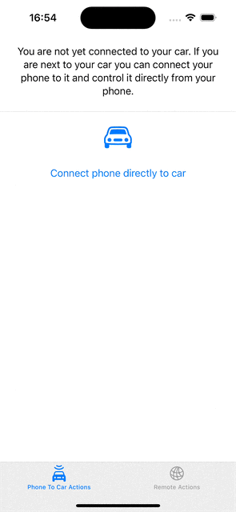

# Mobile O11y Demo

Welcome to the Mobile O11y Demo repository! This project demonstrates how to integrate OpenTelemetry into your mobile applications and visualize the telemetry data using Grafana Cloud.

This is still a work in progress. This is the first very early version.
Currently only iOS is supported. Soon Flutter will come.

## Overview

This demo consists of a mobile application and backend infrastructure designed to simulate a real-world car manufacturer’s ecosystem (But with a very very limited feature set). The mobile app is a pretend car manufacturer app, allowing users to lock and unlock their fake car, either directly via some pretend Bluetooth communication or through interactions via a backend.

Why use a car manufacturer app for this demo? Car apps present an interesting use case because they typically rely not only on REST interactions with a backend but also support direct interactions between the mobile app and the car using technologies like Bluetooth and NFC. This means these apps need to monitor both backend requests and direct interactions between the phone and the car. (Plus, it is also fun to play with cars 😁)

The backend setup includes two Node.js servers:

- Observable Motor Command (OMC): The primary server that the mobile app communicates with, emulating a car OEM’s frontend facing server.
- Car Imitator: Acts as a secondary backend server, mimicking the car’s actual backend that the OMC server interacts with.

This setup provides a realistic environment to demonstrate how telemetry data can be collected from both the mobile app and backend servers, then visualized and monitored in Grafana Cloud.

## Features

The mobile app demonstrates 2 types of use cases. One were the app interacts with a car remotely via a backend to perform some actions on the car. And one where the app interacts directly with a car.

- **Remote Backend Actions**

  - **Get Lock Status**:  
    Uses a normal GET request to check the current state of the door lock state
  - **Perform Lock/Unlock**:  
    First a POST request is sent to tell the backend to lock/unlock the car.  
    Then the app starts polling the GetLockStatus to see if and when the car has actually been locked/unlocked

- **Phone to Car Actions**  
  These actions use a fake car communication (since we don't have a real car)

  - **Connect to car**:  
    Tells the FakeCarCommunication to connect. Once you are "connected" you can do more actions.  
    When you are connected you get back a connectedCar object which has info about the car, e.g. the lock state and VIN and more.
  - **Perform Lock/Unlock**:  
    Use the FakeCarCommunication to directly lock/unlock the car. As soon as the state is changed we get an updated connectedCar object and can update the UI.
  - **Perform Software Update on Car**:  
    Use the FakeCarCommunication to upload a fake software update to the car.  
    Once the updated is started, the FakeCarCommunication will provide back fake progress updates.

All of these actions are monitored and the data is sent to Grafana Cloud.  
All span names relating to Remote-Backend-Actions are prefixed with `Remote-` and all span names relating to Phone-To-Car-Actions are prefixed with `Phone2Car-`.

For the Phone-To-Car-Actions we are also collecting all the car meta data and attaching it as span attributes.

## Architecture

Here is a rough overview of how the demo project looks like

<div align="center">
  
</div>

## Setup

### 0. Prerequisites

#### Mobile apps

To run the iOS app you need to have Xcode installed.  
This project was built and tested using Xcode 15.3

#### Backend

To run the backends locally on your machine you will need:

- node & npm
- docker

### 1. Create a .env file

Make a copy of the [.env-example](.env-example) file and name the new file `.env` and place it at the root of this project.  
NOTE: Do not commit this new file. Since it will contain your private otel config data.

### 2. Setup Grafana Cloud

Go to [Grafana.com](https://grafana.com) and set up a new account.
Then go to your account overview and tap the `Configure` button on the OpenTelemetry-tile.

<div align="center">
  
</div>

There you need to find the section called `Environment Variables`.
From there you need to copy the configuration and past it into the `.env` file.

If you don't have a token yet, then you first need to tap the `Generate now` button in the token section.

### 3. Start the fake backends

You can run them locally. Start them by running this command from the project root:

```sh
make start-backends
```

By default they will run at `http://localhost:3000` and `http://localhost:3001`.  
If you change this, then you will need to update all your mobile apps to call the new url.

Note: To stop the backends later you can run:

```sh
make stop-backends
```

### 4. Start up the iOS app

Now you can build and run the iOS app. It is probably easiest to run it on the iOS Simulator (if you want to run it on a real device, then you will need to set up provisioning and signing. This is outside the scope of this example). And you will need to make sure that the device has access to your localhost.

<div align="center">
    
</div>

### 5. Collect some data

Click around a bit. The app has 2 tabs, one for direct interaction from phone to car (this is all faked. Since there is no real car to interact with), and one tab for controlling the car via the local backends.

Now it is time to click a bit. Do some locking/unlocking and update the software of your car.

### 6. Check out your data in Grafana Cloud

After some time, you should be able to see your data in App O11y in Grafana Cloud.

Go here:  
`https://{your-stack-name}.grafana.net/a/grafana-app-observability-app/services`

And you should be able to see something like this

<div align="center">
  
</div>

<div align="center">
  
</div>

<div align="center">
  
</div>

<div align="center">
  
</div>
